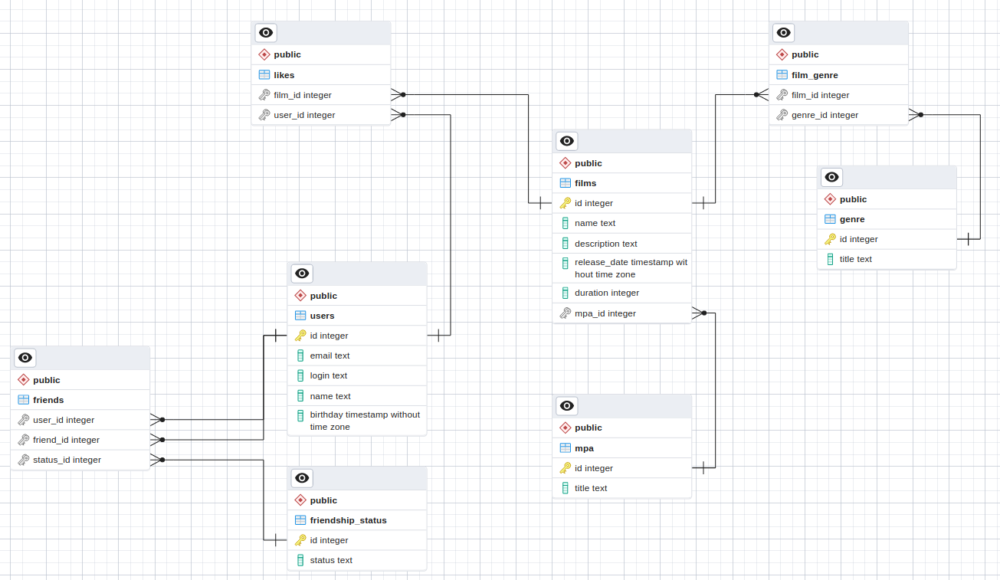

# java-filmorate

## Схема БД:


## Примеры запросов для основных операций приложения:

### Получить список друзей и "статус дружбы":
```sql
SELECT  u.*, 
        fst.status 
FROM users AS u
INNER JOIN friends AS f ON u.id = f.user_id OR u.id = f.friend_id
INNER JOIN friendship_status fst ON  fst.id = f.status_id;
```

### Получить ТОП 10 фильмов и кол-во лайков
```sql
SELECT  f.*, 
		COUNT(u.id) AS likes_count 
FROM films AS f
LEFT OUTER JOIN likes AS l ON f.id = l.film_id
LEFT OUTER JOIN users as u ON l.user_id = u.id
GROUP BY f.id
ORDER BY likes_count DESC;
```
### Получить полную информацию о фильмах
```sql
SELECT  f.*, 
		mpa.title AS mpa_title, 
		string_agg(g.title, ', ')  AS genre
FROM films AS f
LEFT OUTER JOIN film_genre AS fg ON f.id = fg.film_id
LEFT OUTER JOIN genre AS g ON g.id = fg.genre_id
LEFT OUTER JOIN mpa ON f.mpa_id = mpa.id
GROUP BY f.id, mpa.title;
```